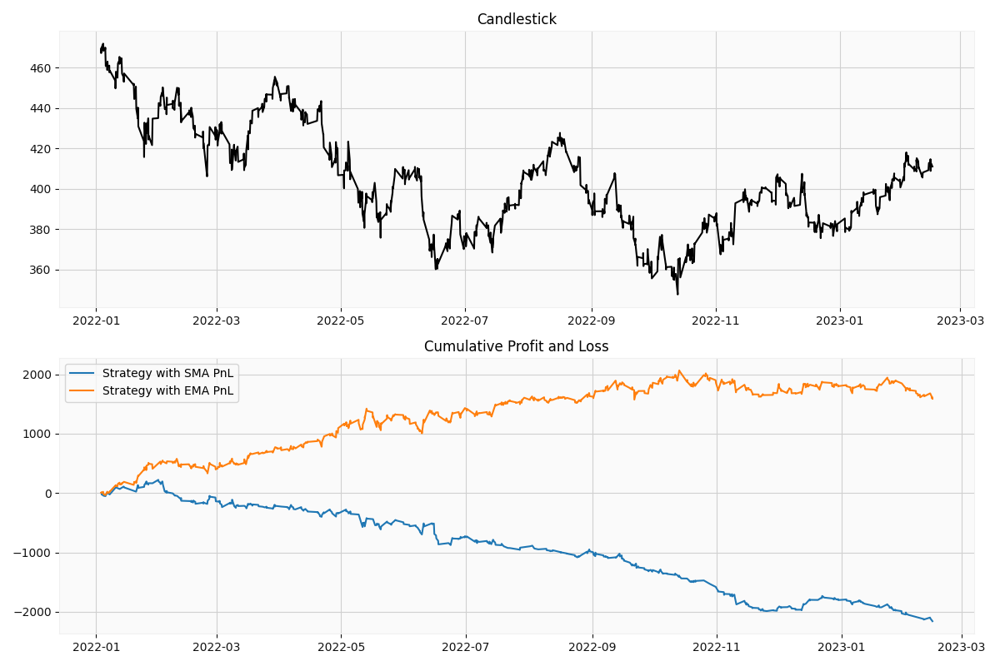

# MultiTimeframeMACrossover-SMA_vs_EMA
Multi Timeframe MA Crossover Strategy - SMA vs EMA

## Backtest Strategy

This is a multi-timeframe moving average crossover strategy

We use 3 Timeframes data:
1. Timeframe 0: 1 min close data
2. Timeframe 1: 5 min close data
3. Timeframe 2: 15 min close data

Further, we use 3 moving averages in all three timeframes:
1. Fast SMA or EMA
2. Medium SMA or EMA
3. Slow SMA or EMA

And we use additional 2 moving averages in the Timeframe 1 for exiting the positions 
1. Fast Exit SMA or EMA
2. Slow Exit SMA or EMA

Entry and Exit Conditions
*   Long Trades
  *   Entry Conditions:
      *   If in time frame 2, fast_ma > medium_ma > slow_ma and 
      *   In time frame 1, fast_ma > medium_ma > slow_ma
      *   In time frame 0, fast_ma > medium_ma > slow_ma
  *   Exit Conditions:
      *   In time frame 1, fast_exit_ma crosses below slow_exit_ma 
*   Short Trades
  *   Entry Conditions:
      *   If in time frame 2, fast_ma < medium_ma < slow_ma and 
      *   In time frame 1, fast_ma < medium_ma < slow_ma
      *   In time frame 0, fast_ma < medium_ma < slow_ma
  *   Exit Conditions:
      *   In time frame 1, fast_exit_ma crosses above medium_exit_ma 

In this notebook, I am comparing how this strategy will perform if we use EMA vs SMA and keep rest of the variable same. The moving avg periods are arbitrary. 

## **Conclusion:**

Below plot shows the Cummulative returns for both strategies.

SMA vs EMA

As seen above, EMA performs better than an SMA for this strategy.

The periods were selected randomly and the trade conditions were exactly same for both cases.
